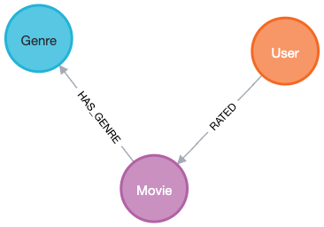
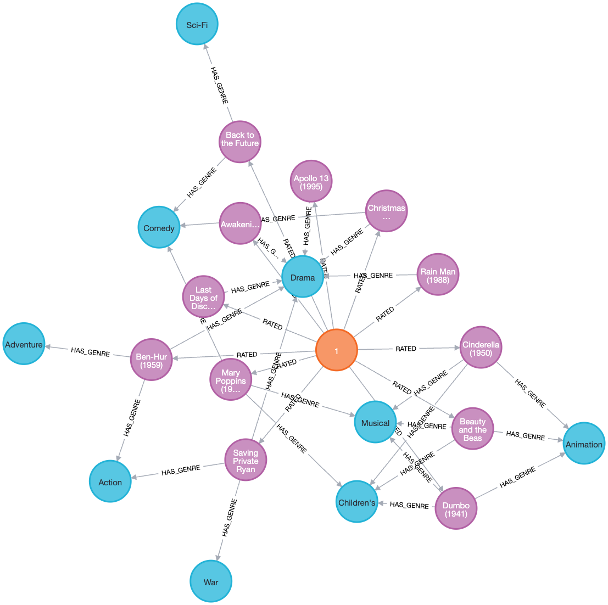
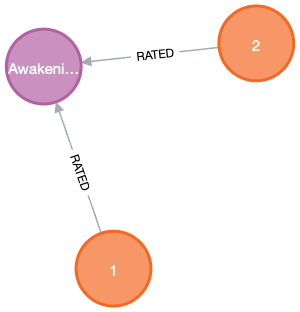
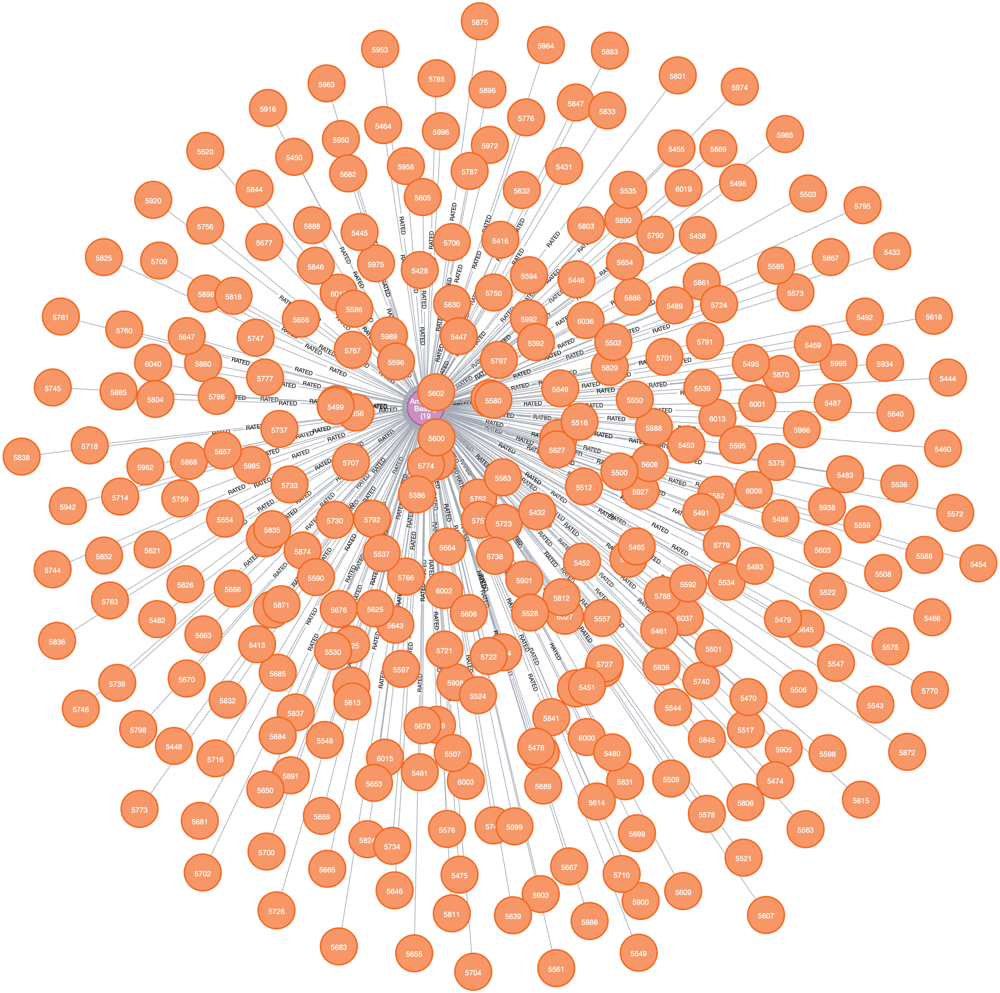

# Частина 1 — Проєктування схеми

## Схема графа

```
        ┌─────────────────────────────────────┐
        │ User                                │
        │   userId      Integer (унікальний)  │
        │   gender      'M' / 'F'             │
        │   age         Integer (код)         │
        │   occupation  Integer (код)         │
        └──────────────────┬──────────────────┘
                           │
                           │  :RATED { rating, timestamp }
                           ▼
        ┌─────────────────────────────────────┐
        │ Movie                               │
        │   movieId  Integer (унікальний)     │
        │   title    String                   │
        │   year     Integer                  │
        └──────────────────┬──────────────────┘
                           │
                           │  :HAS_GENRE
                           ▼
        ┌─────────────────────────────────────┐
        │ Genre                               │
        │   name  String (унікальний)         │
        └─────────────────────────────────────┘
```

Те саме малює й сам Neo4j Browser (`CALL db.schema.visualization()`):



А це фрагмент уже заповненого графа — 5-зіркові фільми user 1 та їхні жанри (помаранчевий вузол — User, рожеві — Movie, блакитні — Genre):



## Вузли та ребра

Вузли:

- `User` — користувач. Властивості: `userId` (унікальний), `gender` ('M' або 'F'), `age`, `occupation`. Вік і професія зберігаються як числові коди з датасету; що означає кожен код — описано в [`import/README`](import/README).
- `Movie` — фільм. Властивості: `movieId` (унікальний), `title`, `year`. Окремого поля з роком у вихідних даних немає — він захований у назві («Toy Story (1995)»), тому виділяємо його під час завантаження.
- `Genre` — жанр, лише `name`. Усього таких вузлів 18.

Ребра:

- `(User)-[:RATED {rating, timestamp}]->(Movie)` — користувач оцінив фільм. `rating` від 1 до 5, `timestamp` — час оцінки в секундах.
- `(Movie)-[:HAS_GENRE]->(Genre)` — фільм належить до жанру, без властивостей.

Тепер про напрямок. У Neo4j ребро завжди спрямоване, але проходити його можна в обидва боки однаково швидко. Тож напрямок я обрав так, щоб речення читалося природно: «користувач RATED фільм», «фільм HAS_GENRE жанр».

## Відповіді на питання

### 1. Що стало вузлами, а що ребрами

Вузли — `User`, `Movie`, `Genre`. Ребра — `RATED` і `HAS_GENRE`.

Розрізняв я їх так. Вузол — це те, що має власний ідентифікатор і існує саме по собі. У користувача є userId, у фільму movieId, у жанру — назва; кожного можна знайти окремо й від нього піти далі по графу (узяти всі фільми користувача, усі фільми жанру). Тому вони вузли.

Ребро — це факт, що поєднує дві такі сутності й без них не існує. «Оцінив» має сенс лише між конкретним користувачем і конкретним фільмом, «має жанр» — лише між фільмом і жанром. Окремо їх ніхто не шукає й не описує, тому це зв'язки, а не вузли.

### 2. Оцінка — ребро чи окремий вузол

Я зробив оцінку ребром: `(User)-[:RATED {rating, timestamp}]->(Movie)`. Варіант з окремим вузлом теж має право на життя, тому поясню вибір.

Якби оцінка була вузлом, вийшло б так:

```
(User)-[:GAVE]->(Rating {rating, timestamp})-[:OF]->(Movie)
```

| | Ребро (обрано) | Окремий вузол |
|--|--|--|
| Скільки додається об'єктів | 1 млн ребер | 1 млн вузлів і ще стільки ж ребер |
| Шлях від користувача до фільму | один крок | два кроки |
| Середнє, кількість оцінок | рахується одразу | повільніше |
| Причепити щось до самої оцінки | не можна | можна |

У цьому датасеті оцінка — це лише число й час, більше до неї нічого не прив'язано: немає ні тексту рецензії, ні тегів, ні позначок «корисно» від інших користувачів. Робити з неї окремий вузол означало б додати ще мільйон вузлів і подовжити кожен шлях «користувач–фільм» удвічі, не отримавши натомість нічого. Тому ребро.

Окремий вузол був би доречний, якби навколо оцінки треба було щось нарощувати: рецензію, теги саме до цієї оцінки, реакції інших на неї. До ребра інше ребро не приєднаєш, тож тоді оцінку довелося б робити вузлом. Тут такої потреби немає.

### 3. Чому жанри — окремі вузли, а не список у фільмі

Жанри можна було б тримати прямо у фільмі списком: `(:Movie {genres: ['Action', 'Comedy']})`. Я виніс їх в окремі вузли, і ось чому.

- Пошук за жанром простіший. Зі списком запит «усі фільми Action» мусив би перебрати всі фільми й у кожного зазирнути в список. З окремим вузлом я беру вузол Action і йду по його зв'язках прямо до потрібних фільмів, не торкаючись решти.
- Легко знаходити спільне між фільмами. «Фільми одного жанру» — це короткий шаблон `(m1)-[:HAS_GENRE]->(g)<-[:HAS_GENRE]-(m2)`. Зі списками довелося б порівнювати рядки в кожної пари фільмів.
- Немає дублювання. Замість слова 'Action' у тисячах фільмів (де одна одруківка тихо створює ще один жанр) є 18 вузлів, на які всі посилаються.
- Згодиться далі. Через спільні жанри зручно робити рекомендації й запускати алгоритми GDS у частинах 4–5. До того ж популярні жанри (Drama, Comedy) стають супервузлами — саме їх розбираємо в частині 4.

---

# Частина 2 — Завантаження даних

Усі запити лежать у [`queries/part2_load.cypher`](queries/part2_load.cypher). Вихідні `.dat` уже сконвертовані в CSV скриптом [`convert.py`](convert.py) (роздільник кома, кодування UTF-8). Запустити завантаження можна так:

```
cypher-shell -u neo4j -p password123 -f part2_load.cypher
```

Теку `./import` змонтовано в контейнер як import-каталог Neo4j, тому шляхи у `LOAD CSV` короткі — `file:///users.csv`. Спершу обмеження, потім вузли, насамкінець оцінки.

## Обмеження унікальності

```cypher
CREATE CONSTRAINT user_id  IF NOT EXISTS FOR (u:User)  REQUIRE u.userId  IS UNIQUE;
CREATE CONSTRAINT movie_id IF NOT EXISTS FOR (m:Movie) REQUIRE m.movieId IS UNIQUE;
CREATE CONSTRAINT genre_nm IF NOT EXISTS FOR (g:Genre) REQUIRE g.name    IS UNIQUE;
```

Створюю їх найпершими, ще до вузлів. По-перше, це не дасть з'явитися двом користувачам з одним userId чи двом однаковим жанрам. По-друге, і це головне для швидкості, обмеження унікальності в Neo4j автоматично створює індекс на цій властивості. Завдяки цьому і MERGE вузлів нижче, і MATCH під час завантаження мільйона оцінок шукають по індексу, а не перебирають усі вузли. `IF NOT EXISTS` дає змогу перезапускати скрипт без помилки «обмеження вже існує».

## Вузли User

```cypher
LOAD CSV WITH HEADERS FROM 'file:///users.csv' AS row
MERGE (u:User {userId: toInteger(row.userId)})
SET u.gender     = row.gender,
    u.age        = toInteger(row.age),
    u.occupation = toInteger(row.occupation);
```

`LOAD CSV WITH HEADERS` читає файл і віддає кожен рядок як мапу з ключами-заголовками (`row.userId` і так далі). Значення з CSV завжди приходять рядками, тому числові поля обгортаю в `toInteger` — інакше userId зберігся б як текст і не зійшовся б з оцінками. `MERGE` шукає користувача за userId і створює його, лише якщо такого ще немає, тож повторний запуск не наплодить дублів. `SET` дописує решту властивостей.

## Вузли Movie, жанри й ребра HAS_GENRE

```cypher
LOAD CSV WITH HEADERS FROM 'file:///movies.csv' AS row
MERGE (m:Movie {movieId: toInteger(row.movieId)})
SET m.title = row.title,
    m.year  = toInteger(substring(row.title, size(row.title) - 5, 4))
WITH m, row
UNWIND split(row.genres, '|') AS genreName
MERGE (g:Genre {name: genreName})
MERGE (m)-[:HAS_GENRE]->(g);
```

За один прохід по файлу робиться три речі. Спершу MERGE створює фільм. Окремого поля з роком у даних немає, але всі назви закінчуються на «(рррр)» (перевірив — так у всіх 3883 рядках), тому витягую рік як чотири символи перед останньою дужкою через `substring(title, size(title) - 5, 4)`. Далі `split(row.genres, '|')` розбиває рядок жанрів на список, `UNWIND` розгортає список в окремі рядки, і для кожного жанру MERGE створює або знаходить вузол `Genre` та зв'язок `HAS_GENRE`. Оскільки MERGE шукає жанр за іменем, усі бойовики чіпляються до одного спільного вузла Action, а не плодять копії.

## Індекси

Окремого `CREATE INDEX` тут немає навмисно. Індекси, потрібні для швидкого пошуку вузлів при завантаженні оцінок, уже є — їх дали обмеження унікальності з першого кроку (обмеження = перевірка + індекс). Ще один індекс на тих самих властивостях був би зайвий.

## Ребра RATED — батчами через APOC

```cypher
CALL apoc.periodic.iterate(
  'LOAD CSV WITH HEADERS FROM "file:///ratings.csv" AS row RETURN row',
  'MATCH (u:User  {userId:  toInteger(row.userId)})
   MATCH (m:Movie {movieId: toInteger(row.movieId)})
   MERGE (u)-[r:RATED]->(m)
   SET r.rating    = toInteger(row.rating),
       r.timestamp = toInteger(row.timestamp)',
  {batchSize: 10000, parallel: false}
);
```

Оцінок мільйон з гаком. Якщо лити їх однією транзакцією, Neo4j тримає всі зміни в пам'яті до коміту й падає по таймауту або браку пам'яті. `apoc.periodic.iterate` розв'язує це поділом на батчі. Перший запит (зовнішній) лише читає рядки, другий (внутрішній) виконується для кожного рядка, а `batchSize: 10000` комітить роботу пачками по 10 тисяч — кожна пачка окрема транзакція, пам'ять не росте.

Внутрішній запит знаходить уже наявні вузли через MATCH (вони створені на кроках 1–2) і з'єднує їх ребром. Ребро роблю через MERGE, а не CREATE, з тієї ж причини, що й усе інше — щоб повторний запуск не додав другий такий самий зв'язок.

`parallel: false` обрано свідомо. Вузли я лише читаю (MATCH), але саме ребро створюю через MERGE, а воно бере блокування на обидва кінці. Популярний фільм трапляється в багатьох батчах водночас, тож паралельні потоки чіплялися б за той самий вузол і могли б зайти в дедлок. Послідовно повільніше, зате надійно.

## Перевірка

```cypher
MATCH (u:User)         RETURN count(u) AS users;
MATCH (m:Movie)        RETURN count(m) AS movies;
MATCH (g:Genre)        RETURN count(g) AS genres;
MATCH ()-[r:RATED]->() RETURN count(r) AS ratings;
```

Має вийти 6040 користувачів, 3883 фільми, 18 жанрів і 1 000 209 оцінок. Якщо числа збігаються — дані завантажилися без втрат.

---

# Частина 3 — Запити різної складності

Усі запити лежать у [`queries/part3.cypher`](queries/part3.cypher). Нижче — що робить кожен і чому написаний саме так.

## Запит 1. Трилери з середнім рейтингом вище 4.0

```cypher
MATCH (:Genre {name: 'Thriller'})<-[:HAS_GENRE]-(m:Movie)<-[r:RATED]-()
WITH m, avg(r.rating) AS avg_rating, count(r) AS num_ratings
WHERE avg_rating > 4.0
RETURN m.title AS movie, round(avg_rating, 2) AS avg_rating, num_ratings
ORDER BY avg_rating DESC;
```

Стартую від вузла жанру Thriller, а не від усіх фільмів — завдяки індексу на `name` це одразу веде лише до трилерів, а не сканує всю базу. Від кожного фільму йду по вхідних ребрах `RATED` і рахую середній рейтинг та кількість оцінок. `avg`/`count` групують по фільму (бо в `WITH` тільки `m` не агрегований), а `WHERE` після агрегації відсіює тих, у кого середнє не дотягує до 4.0. Кількість оцінок виводжу поряд, щоб було видно, на скількох голосах тримається середнє.

## Запит 2. Користувачі з понад 50 п'ятірками

```cypher
MATCH (u:User)-[r:RATED]->(:Movie)
WHERE r.rating = 5
WITH u, count(r) AS fives
WHERE fives > 50
RETURN u.userId AS user_id, fives
ORDER BY fives DESC;
```

Беру всі ребра `RATED` з оцінкою 5 (перший `WHERE` відсікає решту ще до підрахунку), групую по користувачу й лишаю тих, у кого таких оцінок більше 50. Два `WHERE` тут навмисно — перший на ребро, другий на вже порахований підсумок.

## Запит 3. Що високо оцінили обидва — user 1 і user 2

```cypher
MATCH (u1:User {userId: 1})-[r1:RATED]->(m:Movie)<-[r2:RATED]-(u2:User {userId: 2})
WHERE r1.rating >= 4 AND r2.rating >= 4
RETURN m.title AS movie, r1.rating AS rating_u1, r2.rating AS rating_u2
ORDER BY m.title;
```

Один патерн зчіплює обох користувачів через той самий фільм: `(u1)-[r1]->(m)<-[r2]-(u2)`. Те, що `m` посередині спільний, і означає «обидва оцінили цей фільм». `WHERE` вимагає, щоб кожна з двох оцінок була не нижче 4.

## Запит 4. Жанри за середнім рейтингом і обсягом

```cypher
MATCH (g:Genre)<-[:HAS_GENRE]-(:Movie)<-[r:RATED]-()
WITH g, avg(r.rating) AS avg_rating, count(r) AS num_ratings
RETURN g.name AS genre, round(avg_rating, 3) AS avg_rating, num_ratings
ORDER BY avg_rating DESC;
```

Для кожного жанру збираю всі оцінки всіх його фільмів і рахую середнє та кількість. Кількість тут не менш важлива, ніж середнє. Високий бал на десятку оцінок — випадковість, а такий самий бал на десятках тисяч — це вже стабільно, тому виводжу обидва числа й сортую за середнім.

## Запит 5. «Користувачі зі схожими смаками також дивилися»

```cypher
MATCH (me:User {userId: 1})-[r1:RATED]->(common:Movie)<-[r2:RATED]-(other:User)
WHERE r1.rating >= 4 AND r2.rating >= 4 AND me <> other
WITH me, other, count(common) AS shared_taste
ORDER BY shared_taste DESC
LIMIT 50
MATCH (other)-[r3:RATED]->(rec:Movie)
WHERE r3.rating >= 4 AND NOT EXISTS { (me)-[:RATED]->(rec) }
RETURN rec.title AS recommendation,
       count(DISTINCT other) AS recommended_by,
       round(avg(r3.rating), 2) AS avg_rating
ORDER BY recommended_by DESC, avg_rating DESC
LIMIT 10;
```

Це класична колаборативна фільтрація, і вона робиться в два кроки. Спершу шукаю користувачів зі схожим смаком — тих, хто високо оцінив ті самі фільми, що й user 1. Чим більше таких спільних фільмів (`shared_taste`), тим ближчий смак, тому беру топ-50 найсхожіших. `LIMIT 50` тут не лише для швидкості — він прибирає випадкових людей, що збіглися з нами на одному блокбастері, і лишає справді близьких.

Другий крок бере фільми, які ці схожі люди оцінили на 4+, і викидає ті, що user 1 уже бачив. Умова `NOT EXISTS { (me)-[:RATED]->(rec) }` тут ключова — без неї в рекомендації потрапило б уже переглянуте. Ранжую за тим, скільки схожих користувачів радять фільм.

## Запит 6. Найкоротший ланцюжок між двома користувачами

```cypher
MATCH path = shortestPath(
  (a:User {userId: 1})-[:RATED*..10]-(b:User {userId: 2})
)
RETURN length(path) AS hops,
       [n IN nodes(path) |
         CASE WHEN n:User THEN 'User#' + toString(n.userId) ELSE n.title END] AS chain;
```

`shortestPath` шукає найкоротший шлях між двома користувачами по ребрах `RATED`. Напрямок не фіксую (`-[:RATED*..10]-`, без стрілки), бо ланцюжок іде то «вниз» від користувача до фільму, то «вгору» від фільму до іншого користувача. `*..10` обмежує пошук десятьма кроками, щоб він не блукав без меж. У `RETURN` розгортаю вузли шляху в читабельний ланцюжок виду `User#1 → фільм → User#2`.

Ось цей шлях очима Neo4j Browser — два вузли User, з'єднані через один спільний Movie (довжина 2):



## Довжина шляху — відповіді на питання

Довжина шляху — це кількість ребер `RATED` між двома користувачами. Вузли в ланцюжку чергуються (користувач, фільм, користувач, фільм), тому довжина завжди парна.

Один хоп — це крок по одному ребру `RATED`. Тому найкоротший зв'язок між двома користувачами має вигляд `user1 —RATED→ фільм ←RATED— user2` — два ребра й спільний фільм посередині, який обидва оцінили. Це довжина 2.

Довжина 4 означає, що між користувачами є один проміжний. Спільного фільму в них немає, але знайдеться хтось третій, хто оцінив по фільму з кожним — `user1 — фільм A — userX — фільм B — user2`. Спільний смак не прямий, а через посередника. Довжина 6 — це вже двоє проміжних (`user1 — A — userX — B — userY — C — user2`), зв'язок ще опосередкованіший.

На практиці в цьому датасеті майже будь-які двоє користувачів з'єднані за 2 кроки — популярні фільми зібрали тисячі оцінок і працюють як супервузли, що ріднять майже всіх. Тому шляхи довжини 4 чи 6 трапляються хіба між дуже відлюдними користувачами — тими, хто оцінив лише рідкісні фільми. До супервузлів повернемося в Частині 4.

---

# Частина 4 — Виявлення супервузлів

Запити — у [`queries/part4_supernodes.cypher`](queries/part4_supernodes.cypher).

## Запит 1. Що вважати нормою

```cypher
MATCH (n)
WITH labels(n)[0] AS label, COUNT { (n)--() } AS degree
RETURN label, count(*) AS nodes,
       min(degree) AS min_deg, round(avg(degree)) AS avg_deg, max(degree) AS max_deg
ORDER BY max_deg DESC;
```

`COUNT { (n)--() }` рахує всі ребра вузла в обидва боки — його степінь. Дужки `--` без стрілки, бо у фільму ребра ідуть в обидва напрямки (вхідні RATED, вихідні HAS_GENRE). Згрупувавши степінь по лейблах, дивлюся на min/avg/max — без цієї бази слова «аномально багато ребер» нічого не означають. Виходить, що типовий фільм має 259 зв'язків, а максимум — 3430; у користувачів 166 проти 2314; у жанрів, хоч їх лише 18, середнє аж 356. Розрив між середнім і максимумом — перший натяк на супервузли.

## Запит 2. Самі супервузли

```cypher
MATCH (n)
WITH n, COUNT { (n)--() } AS degree
ORDER BY degree DESC
LIMIT 15
RETURN labels(n)[0] AS label,
       coalesce(n.title, n.name, 'user ' + toString(n.userId)) AS node,
       degree;
```

Той самий степінь, але тепер сортую за спаданням по всіх вузлах і беру топ-15. `coalesce` підставляє читабельну назву — title для фільму, name для жанру, інакше userId. Верхівка суцільно з популярних фільмів, очолює American Beauty з 3430 зв'язків, далі трилогія Star Wars (~2900–3000), Jurassic Park, Matrix. Кожен зчеплений з тисячами користувачів через RATED.

Ось як супервузол виглядає очима Neo4j Browser — American Beauty в центрі й сотні глядачів-променів навколо. Browser намалював лише перші 300 ребер із 3428, і сам факт, що йому довелося обрізати показ, наочно ілюструє проблему.



## Запит 3. А жанри?

```cypher
MATCH (g:Genre)
RETURN g.name AS genre, COUNT { (g)<-[:HAS_GENRE]-() } AS movies
ORDER BY movies DESC;
```

Степінь жанру — це скільки фільмів вказують на нього через HAS_GENRE. Drama тримає 1603 фільми, Comedy 1200, і так аж до Film-Noir з 44. Навіть найменший жанр — хаб, а Drama й Comedy — відверті супервузли. Тобто так, жанри теж супервузли.

## Відповіді на питання

### 1. Які вузли — супервузли і скільки в них зв'язків

Три типи.

- Популярні фільми — найбільші. American Beauty має 3430 зв'язків (≈3428 оцінок плюс жанри), трилогія Star Wars по ~2900–3000, далі Jurassic Park, Matrix, Saving Private Ryan. Типовий фільм при цьому тримає 259.
- Жанри — усі 18 є хабами. Drama тримає 1603 фільми, Comedy 1200, найменший Film-Noir 44, середній — 356.
- Активні користувачі теж — user 4169 має 2314 оцінок проти типових 166.

### 2. Чому запит по супервузлу повільніший за запит по звичайному з тими ж індексами

Індекс прискорює тільки пошук вузла. Знайти American Beauty за назвою так само швидко, як будь-який інший фільм. Але коли ми вже стоїмо на вузлі й починаємо йти по його ребрах, доводиться перебрати їх усі. Кожен вузол зберігає список своїх зв'язків, тож розгорнути вузол із 3430 ребрами — це прочитати 3430 записів, а зі звичайного — п'ять. Індекс до цього непричетний, він лишився позаду, на кроці пошуку.

Тому «хто оцінив American Beauty?» проходить 3428 ребер, а «хто оцінив рідкісний фільм?» — п'ять, хоча сам фільм обидва знайшли за один погляд в індекс. На багатокрокових обходах ще гірше — від супервузла фронт пошуку роздувається (3428 користувачів, далі їхні фільми, далі ще глибше), і вартість вибухає. Запис теж страждає. MERGE ребра до супервузла бере на ньому блокування й звіряється з усіма наявними ребрами, тож паралельні записи серіалізуються саме на ньому — через це в Частині 2 і стояло `parallel: false`.

### 3. Яку стратегію застосувати для цього датасету

Так, жанри — супервузли (Drama 1603, Comedy 1200). Але в нас вони працюють лише як точки фільтрації й агрегації, а не як транзитні вузли обходу. Тому конкретна стратегія — не пускати обходи через жанровий хаб.

- Для «всіх фільмів жанру X» розгалуження в 1603 неминуче, але обмежене й прийнятне — ми робимо це зрідка й свідомо.
- А шляхи між користувачами шукаємо тільки по RATED (як у Запиті 6 з Частини 3). Якби ми дозволили ходити через HAS_GENRE, будь-які двоє глядачів драм з'єдналися б через вузол Drama, і пошук захлинувся б у його 1603 ребрах. Жанри лишаються осторонь маршрутів.

Якби обходи через жанри все ж стали вузьким місцем, я б застосував класичне дроблення супервузла — розбити кожен жанр на під-вузли за десятиліттям (Drama → Drama-1990 → фільми), щоб замість 1603 ребер з одного вузла було близько 150 на під-вузол. Менше розгалуження на кожному кроці, а модель лишається логічно тією самою.
